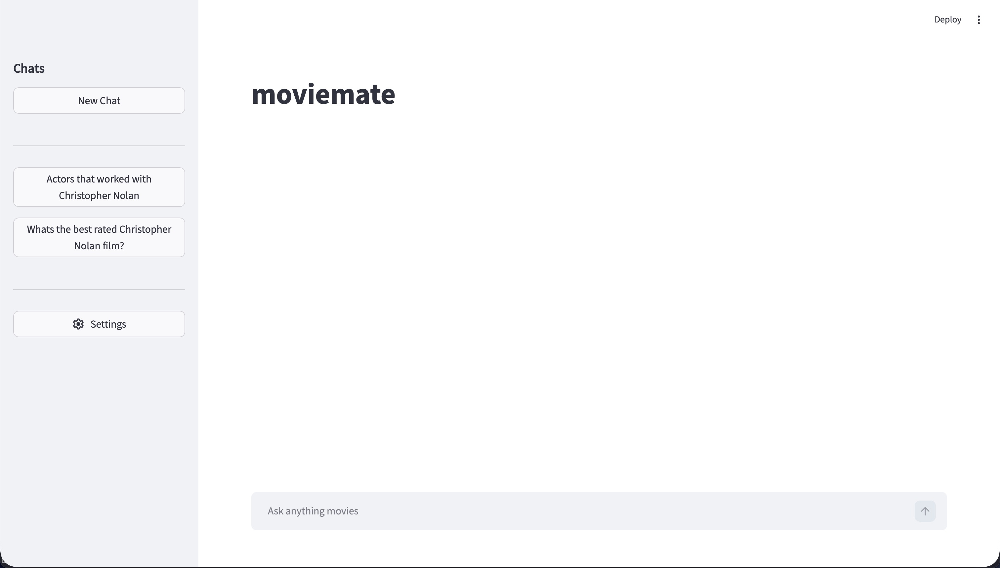
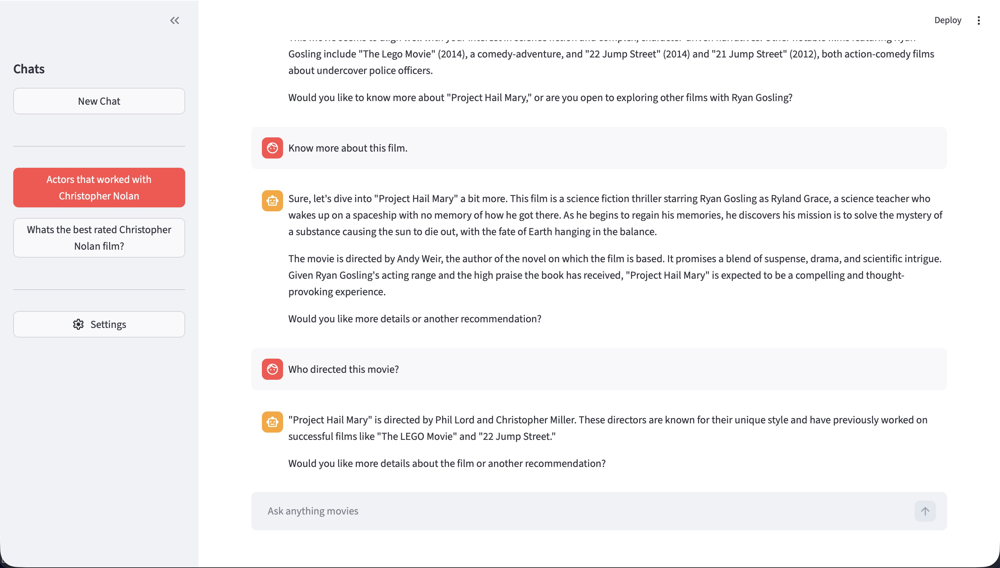
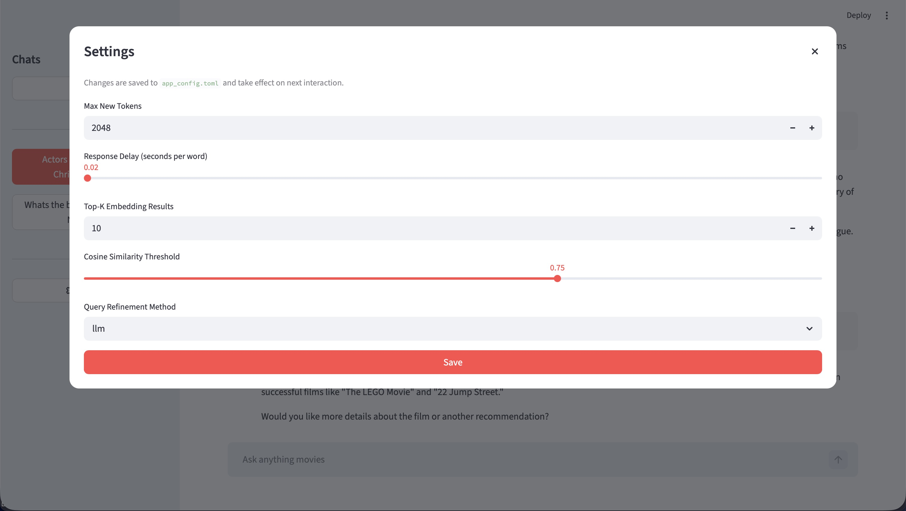
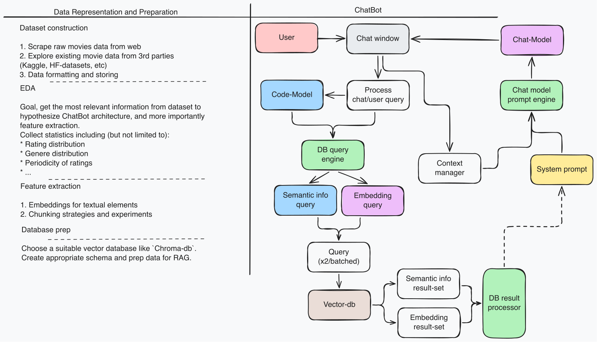

# MovieMate

Ask movie questions, and get answers from a database of 5000 movies data
sourced from TMDB via the TMDB-API.







> ![NOTE]
> The settings are essentially dev opts, you can access them with the password
> 1234.

## Models

* Embedding Model: `all-mpnet-base-v2`
* Chat Model: `Qwen2.5-7B-Instruct`
* Code Model: `Qwen2.5-7B-Instruct`
* Enriching Model: `Qwen2.5-1.5B-Instruct`

I did try out some other chat models, few worked better, few worse.
In the end, the current model (Qwen2.5 7B Instruct) performed the best.

Please go to `models/README.md` to get a better idea of each model.

---

System design/arch:



> [!NOTE]
> This arch is not complete, its what i had in mind before starting the
> project... This image is slightly different from the current, implemented
> architecture.
>
> Im dont really want to update the diagram rn, so... yeah.

---

## EDA

See notebook in `notebooks/`

---

## Local Setup

> [!IMPORTANT]
> `data/data_engine.py` has a function `_create_db()`, use that to create
> the database from `data/raw_movies.csv`.
> 
> To do this, run `python -m data.data_engine`.
> Select option [1], followed by batch-size according to ur GPU's memory spec.

Setup ur env to run this project (macos):

```bash
# Install postgresql
brew install postgresql
brew services start postgresql@18  # change version if required

# Install vector extension for psql
brew install pgvector
# Read pgvector docs to enable inside psql

# Setup python env
uv ...
# Just see uv docs

uv sync

# Ya done!
```

I also attached in requirements file if you wish to setup via pip.


## Additional notes

I did want to perform evals on this system, use some dataset and get some
metrics to compare with other (Hybrid) RAG systems.
However, due to time and compute constraints, I wasn't able to do that.
